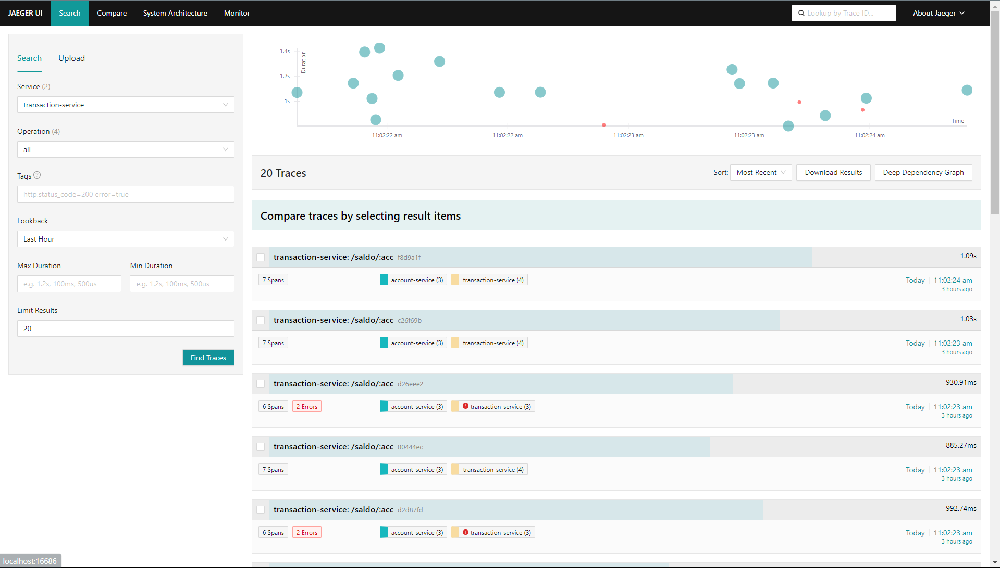

# System Observability with Open Telemetry & Jaeger Demo
## Introduction
Observability means ability to observe what happens in our applications. It involves logs, traces, and metrics from applications and systems.  Applications can generate logs, traces, and metrics using Open Telemetry protocol. Open Telemetry protocol is a standard protocol for generating logs, traces, and metrics. It provide SDK and API for many programming language. With Open Telemetry, our logs, traces, and metrics by any vendor which support that support Open Telemetry Protocol.

This repository serve as a demonstration how to add observability to our applications using Open Telemetry Protocol. In this demo, we will focus on how to generate traces and metrics using Open Telemetry and how to visualize it in monitoring application. We use simple Go HTTP services as traces and metrics generator, Jaeger to display our traces, Open Telemetry Collector as traces and metrics receiver also exporter to Jaeger Collector and Prometheus, Prometheus as metrics backend and Grafana to display our metrics. We also use alpha feature Open Telemetry Collector Connector to automatically generate metrics based on generated span.

## Architecture
The following diagram is the architecture of this demo:

1. cassandra: Cassandra database for storing traces data
2. otel-collector: Open Telemetry Collector for receiving traces and metrics from application and exporting traces and metrics to Jaeger and Prometheus
3. prometheus: Metrics backend engine for processing metrics data
4. grafana: Dashboard UI for monitoring generated services metrics
5. jaeger-collector: Traces collector from Jaeger for receiving traces from otel-collector and storing traces to cassandra database
6. jaeger-query: Dashboard UI for visualizing traces data
7. account-services: Dummy services act as account number validation
8. transaction-services: Dummy services act as balance inquiry and withdrawl balance

## API
- account-service:
  1. /validate/:acc = API for validating account number from transaction services
- transaction-service:
  1. /saldo/:acc = API for balance inquiry
  2. /tarik = API for withdrawl balance

For API request paramaters and payloads detail, check `script.js` in root directory 

## Sample UI
- Jaeger traces dashboard

- Visualize traces detail data in Jaeger

- Visualize some of metrics in Grafana

## Instructions
1. Initiate Cassandra database container by running `cassandra/docker.<ps1/sh>`
2. Initiate Cassandra database schema by running `cassandra/schema.<ps1/sh>`
3. Initiate the services by using docker compose `docker compose up -d`
4. Hit services API using prefered HTTP client
5. (Optional) Generate many request automatically using `k6 run script.js`

## References
- Open Telemetry: refer to this [link](https://opentelemetry.io/docs/concepts/observability-primer/)
- Open Telemetry Collector: refer to this [link](https://opentelemetry.io/docs/collector/quick-start/)
- Instrument your Go Application using Open Telemetry: refer to this [link](https://opentelemetry.io/docs/languages/go/instrumentation/)
- Tracing with Jaeger: refer to this [link](https://www.jaegertracing.io/docs/1.56/)
- Services Perfomance Monitoring with Open Telemetry Collector Connector and Jaeger: refer to this [link](https://github.com/jaegertracing/jaeger/tree/main/docker-compose/monitor)